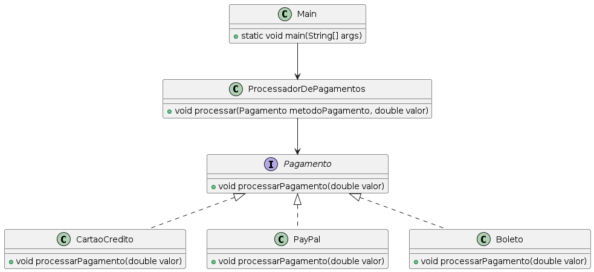

# Exemplo Prático de Usabilidade das Interfaces em um Cenário Profissional

Suponha que estamos desenvolvendo um sistema de pagamento onde diferentes métodos de pagamento (como cartão de crédito, débito, e boleto) precisam ser suportados.

